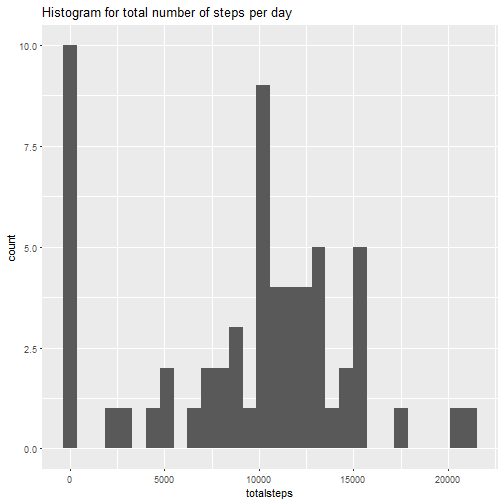
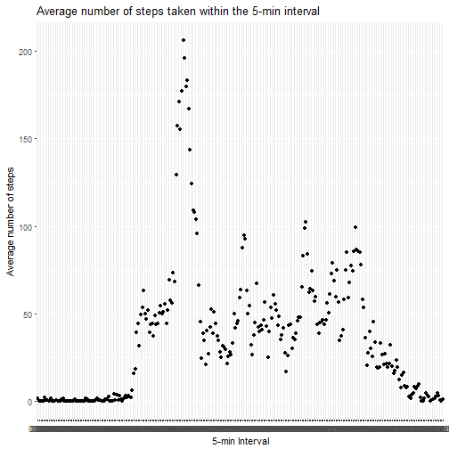
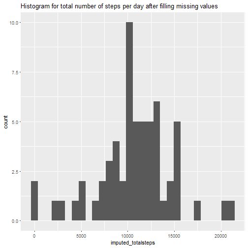
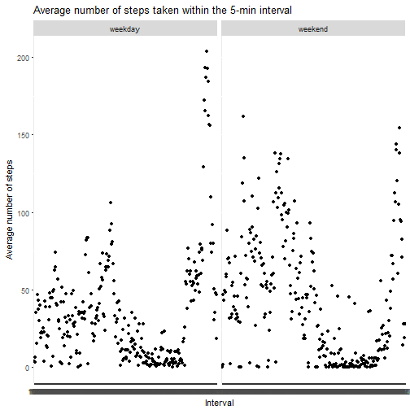

## Loading and preprocessing the data


```r
library(ggplot2)
data <- read.csv("activity.csv")
```

## What is mean total number of steps taken per day?


```r
# Calculate the total number of steps taken per day

totalsteps <- tapply(data$steps, data$date, sum, na.rm=TRUE)

# Make a histogram of the total number of steps taken each day

qplot(totalsteps,geom="histogram", 
      main = "Histogram for total number of steps per day")
```

```
## `stat_bin()` using `bins = 30`. Pick better value with `binwidth`.
```



```r
# Calculate and report the mean and median of the total number of steps taken per day

mean(totalsteps)
```

```
## [1] 9354.23
```

```r
median(totalsteps)
```

```
## [1] 10395
```

## What is the average daily activity pattern?


```r
# Make a time series plot of the 5-minute interval (x-axis) and 
# the average number of steps taken, averaged across all days (y-axis)

avgsteps <- tapply(data$steps, data$interval, mean, na.rm=TRUE)
interval <- sprintf("%04d", data$interval)
dailysteps <- data.frame(interval = unique(interval), steps = avgsteps)

ggplot(dailysteps, aes(interval, steps)) +
       geom_point(na.rm=TRUE)+
       ggtitle("Average number of steps taken within the 5-min interval")+
       xlab("5-min Interval")+ylab("Average number of steps")
```



```r
# Which 5-minute interval, on average across all the days in the dataset, 
# contains the maximum number of steps?

maxtimeloc <- which.max(dailysteps$steps)
dailysteps[maxtimeloc, "interval"]
```

```
## [1] 0835
## 288 Levels: 0000 0005 0010 0015 0020 0025 0030 0035 0040 0045 0050 ... 2355
```

## Imputing missing values


```r
# Calculate and report the total number of missing values in the dataset

sum(is.na(data$steps))
```

```
## [1] 2304
```

```r
# Devise a strategy for filling in all of the missing values in the dataset.

# impute with mean value using randomization
# Create a new dataset that is equal to the original dataset 
# but with the missing data filled in.
library(Hmisc)
imputed_data <- data
imputed_data$steps <- with(data, impute(data$steps, 'random'))


# Make a histogram of the total number of steps taken each day and 
# Calculate and report the mean and median total number of steps taken per day.

imputed_totalsteps <- tapply(imputed_data$steps, imputed_data$date, sum)

qplot(imputed_totalsteps,geom="histogram", 
      main = "Histogram for total number of steps per day after filling missing values")
```

```
## `stat_bin()` using `bins = 30`. Pick better value with `binwidth`.
```



```r
mean(imputed_totalsteps)
```

```
## [1] 10733.49
```

```r
mean(totalsteps)
```

```
## [1] 9354.23
```

```r
median(imputed_totalsteps)
```

```
## [1] 10675
```

```r
median(totalsteps)
```

```
## [1] 10395
```

```r
# Both mean and median of imputed data have increased after filling missing values.
```


## Are there differences in activity patterns between weekdays and weekends?


```r
# Create a new factor variable in the dataset with two levels - "weekday" and "weekend" 
# indicating whether a given date is a weekday or weekend day.
daytype <- function(date) {
  ifelse(weekdays(date) %in% c("Saturday", "Sunday"), "weekend", "weekday")
}
imputed_data$daytype<- as.factor(sapply(
                                 as.Date(imputed_data$date, format="%Y-%m-%d"), 
                                 daytype))

# Make a panel plot containing a time series plot of the 5-minute interval (x-axis) 
# and the average number of steps taken, 
# averaged across all weekday days or weekend days (y-axis).

imputed_avgsteps <- tapply(imputed_data$steps,
                           interaction(imputed_data$interval,
                                    imputed_data$daytype),
                            mean, na.rm=TRUE)
imputed_avgsteps2 <- data.frame(interval = rep(names(avgsteps),2),
                               steps = imputed_avgsteps,
                               daytype = as.factor(c(rep("weekday", 288),
                                                     rep("weekend", 288))))


ggplot(imputed_avgsteps2, aes(interval, steps)) +
  geom_point(na.rm=TRUE)+
  ggtitle("Average number of steps taken within the 5-min interval")+
  xlab("Interval")+ylab("Average number of steps") + facet_wrap(~ daytype)
```


